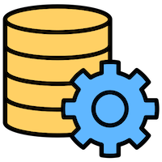
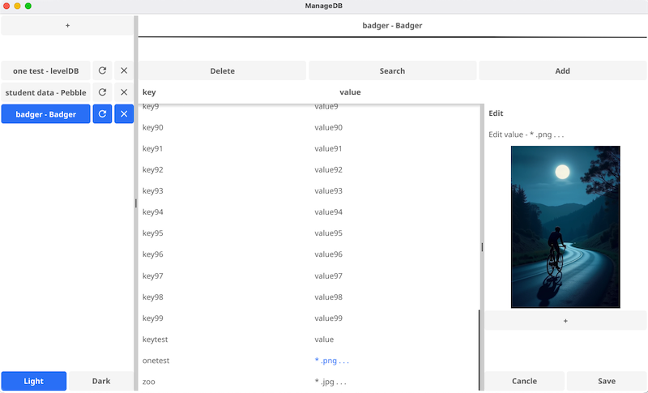
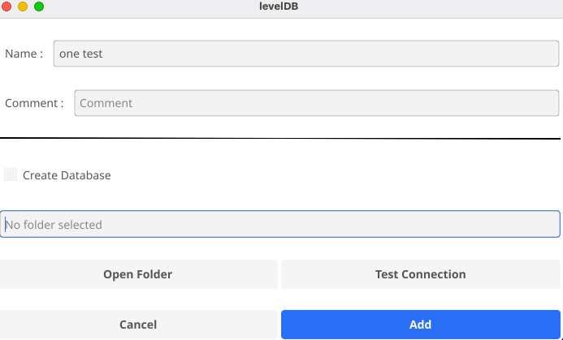
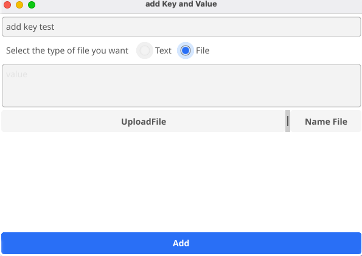

# ManageDB

ManageDB is a simple and user-friendly application for managing key-value databases. It allows users to create, edit, and delete keys, browse database contents, and perform various operations effortlessly.



---

## Features

- Create new key-value databases.  
- Add, edit, or delete keys easily.  
- Assign files and images as values and view them directly within the app.  
- Browse database contents with an intuitive interface.  
- Cross-platform support (details below).  
- Lightweight and efficient, built with Fyne.  

---

## Installation

### macOS
1. Click on **Install** below to download the program:
   - [INSTALL](https://github.com/Mohsen20031203/KV-Toolbox/releases/download/v1.0.0/ManageDB-mac.app.zip)

2. First, copy the program and move it to the **Desktop**
3. When you try to open the app, macOS might display the following error:  
   _“This application ‘ManageDB.app’ can't be opened”._

   Follow these steps to resolve the issue:

   #### Step 1: Grant executable permissions
   1. Open the **Terminal**.
   2. Go to your **Desktop** screen:
      ```bash
      cd ~/Desktop
      ```
   3. Run the following command to grant executable permissions:
      ```bash
      chmod +x ManageDB.app/Contents/MacOS/'KV-Toolbox'
      ```
      ```bash
      xattr -cr ManageDB.app
      ```
   #### Step 2: Reopen the app
   1. Try opening `ManageDB.app` again.
   2. The app should now run without any issues.


### Windows
1. Click on **Install** below to download the program:
   - [INSTALL](https://github.com/Mohsen20031203/KV-Toolbox/releases/download/v1.0.0/ManageDB-windows.exe)
2. Double-click to run the installer and follow the setup instructions.
3. Launch the app from your desktop or start menu.

### Linux
1. Download the `ManageDB.AppImage` file from the [releases section](#).
2. Make the file executable using: `chmod +x ManageDB.AppImage`.
3. Run the file using: `./ManageDB.AppImage`.

---

## How to Use

1. Open the application.
2. **Create a new database**: To create a new database, click on the "+" button and select the database you want, then click on "Create Database" in the opened window and enter the address you want.
2. **Open a new database**: To open a database, click the "+" button and select the database you want, then click the "Open folder" button in the opened window and find your database.
3. **Add keys**: Use the "Add" option to create new key-value pairs.
    - You can also assign files, images, or other types of data as the value for a key. This feature allows you to efficiently manage and store additional resources, such as images and files, directly within your database.
4. **Edit keys**: Find the key you want and click on it to change its value.
5. **Delete keys**: Click the "delete" key in the main window and then enter the key you want.
6. **Search keys**: Click on the search button and enter the key you want.

---

## System Requirements

- **macOS**: Version 10.14 or later.
- **Windows**: Version 7 or later.
- **Linux**: Kernel version 4.0 or later.
- **Storage**: At least 100 MB of free space.

---

## Screenshots

Below are some screenshots showcasing the application in action:

# Main Interface  
  

## Features Overview  

1. **Add a New Database**  
   - In the top-left corner, you'll see a **+ (plus)** button.  
     Use this to add your desired database to the application.

2. **View and Switch Databases**  
   - On the left-hand sidebar, you'll find a list of databases you've added.  
     You can easily switch between your databases from this section.

3. **Explore Database Content**  
   - The middle section displays your database's information, including **keys** and **values**.  
     This is where you can view the content of your selected database.

4. **Perform Specific Actions**  
   - At the top of the interface, you'll find several buttons.  
     Each button allows you to perform specific operations within the application.

5. **Edit Key or Value Details**  
   - On the right-hand sidebar, you'll see detailed information about the selected **key** or **value**.  
     You can edit the details directly from this section.

## Adding a New Database  
  

When you click the **+ (plus)** button to add a new database, a new window will appear. This window includes the following sections:  

1. **Database Name**  
   - Enter a name for your database in the first input field.  
     This name will only be used within the application and its configuration file; it does not change the actual file name of the database.

2. **Comments**  
   - In the next section, you can add a comment to describe your database.  
     This is optional and helps to add descriptive notes.

3. **Create New Database**  
   - The **Create Database** checkbox lets you create a new database instead of reading an existing one.  
     Enable this option to easily initialize a new database.

4. **Database Path**  
   - In the next input field, provide the desired path to your database.  
     You can either type the path manually or use the **Open Folder** button to select it through the application.

5. **Open Folder**  
   - Clicking the **Open Folder** button allows you to choose a file or location.  
     This is used for reading or creating a database in the selected directory.


## Adding New Keys  
  

When you click the **Add** button at the top of the screen, the following window will appear.  
This window allows you to add new values to your database. The values can be either **text-based** or **file-based**, depending on your selection and the options provided in the interface.  
Refer to the image above for guidance on how to use this feature.
